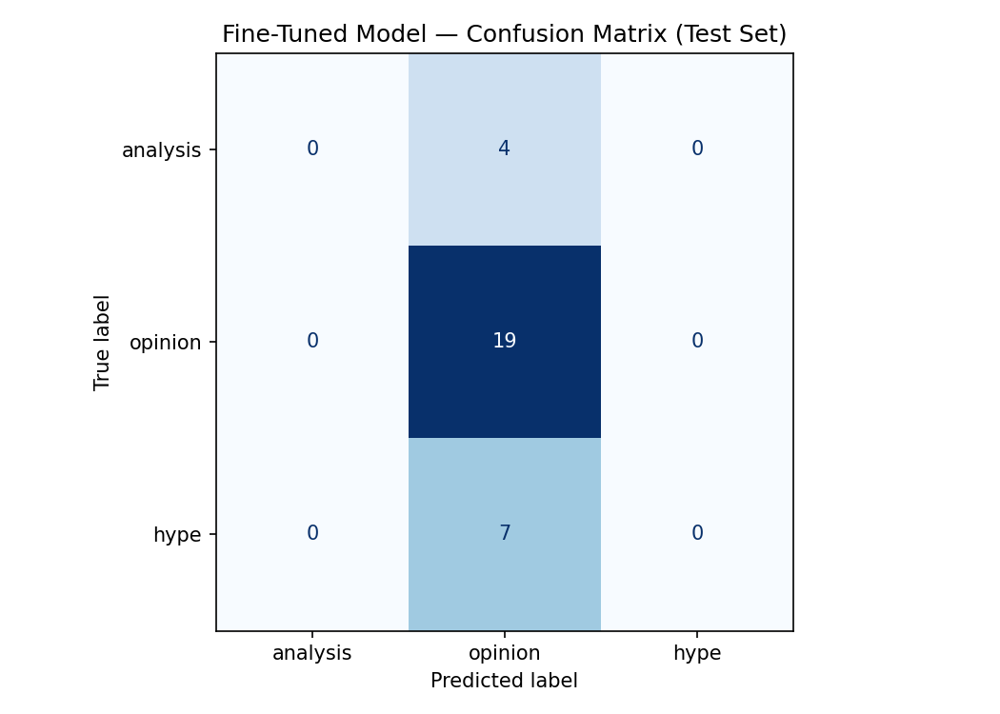

# TakeMeter — AI201 Project 3

A text classifier that categorizes r/leagueoflegends posts into three labels: **analysis**, **opinion**, and **hype**. Built by fine-tuning DistilBERT on 200 manually annotated Reddit posts and evaluated against a Gemini 2.5-flash zero-shot baseline.

---

## Community and Labels

**Community:** r/leagueoflegends (~7 million members)

| Label | Definition |
|-------|-----------|
| `analysis` | A structured argument supported by verifiable evidence (stats, patch notes, replay observations). Evidence forms a reasoning chain, not just a single stat dropped into a rant. |
| `opinion` | A personal preference, judgment, or stance. May cite facts, but the core purpose is asserting a viewpoint rather than building a systematic argument. |
| `hype` | An immediate emotional reaction tied to a specific in-game or esports event. Personal milestone posts (hitting a rank, first win) also count. |

---

## Dataset

- **Source:** r/leagueoflegends posts collected via Reddit RSS feeds (public, no credentials required)
- **Size:** 200 posts
- **Label distribution:** opinion 128 (64%), hype 50 (25%), analysis 22 (11%)
- **Split:** 70% train / 15% validation / 15% test (stratified)
- **Pre-labeling:** Heuristic regex rules applied first; every label manually reviewed and corrected

---

## Results

### Overall Accuracy

| Model | Accuracy |
|-------|----------|
| Zero-shot baseline (Gemini 2.5-flash) | 0.533 |
| Fine-tuned DistilBERT | **0.633** |
| Fine-tuning improvement | +0.100 |

Test set size: 30 examples

---

### Baseline Per-Class Metrics (Gemini 2.5-flash, zero-shot)

| Label | Precision | Recall | F1 | Support |
|-------|-----------|--------|----|---------|
| analysis | 0.00 | 0.00 | 0.00 | 4 |
| opinion | 0.63 | 0.63 | 0.63 | 19 |
| hype | 0.50 | 0.57 | 0.53 | 7 |
| **macro avg** | 0.38 | 0.40 | 0.39 | 30 |

---

### Fine-Tuned Model Per-Class Metrics (DistilBERT)

| Label | Precision | Recall | F1 | Support |
|-------|-----------|--------|----|---------|
| analysis | 0.00 | 0.00 | 0.00 | 4 |
| opinion | 0.63 | 1.00 | 0.78 | 19 |
| hype | 0.00 | 0.00 | 0.00 | 7 |
| **macro avg** | 0.21 | 0.33 | 0.26 | 30 |

---

### Confusion Matrix (Fine-Tuned Model)

|  | Predicted: analysis | Predicted: opinion | Predicted: hype |
|--|--------------------|--------------------|-----------------|
| **True: analysis** | 0 | 4 | 0 |
| **True: opinion** | 0 | 19 | 0 |
| **True: hype** | 0 | 7 | 0 |

---

## Error Analysis

### Which labels are being confused?

The fine-tuned model collapsed entirely to predicting `opinion` for every example. It never predicted `analysis` or `hype` once. This is a **majority-class collapse** — with opinion making up 64% of the training data, the model learned that always predicting `opinion` minimizes training loss, and the signal from analysis (11%) and hype (25%) examples was too weak to overcome that bias.

The overall accuracy of 0.633 is therefore misleading: it exactly matches the proportion of opinion examples in the test set (19/30), and the model has no ability to distinguish the other two classes.

### Three specific wrong predictions

**Wrong prediction #1 — True: `hype`, Predicted: `opinion`**
> *"FAKER JUST 1V5'D I CANNOT BREATHE THIS IS INSANE"*

The post is a pure emotional reaction to a specific esports moment with no argumentative content — a clear `hype` case. The model predicted `opinion` because short, high-energy posts with no statistical language defaulted to the majority class. The model never learned any `hype`-specific surface pattern.

**Wrong prediction #2 — True: `analysis`, Predicted: `opinion`**
> *"Jinx's win rate climbed to 52.4% this patch. The Kraken Slayer interaction means the Q nerf actually improved her damage against tank-heavy comps, which dominate right now."*

This post contains a stat, a patch reference, and a causal reasoning chain — the definition of `analysis`. The model predicted `opinion` because with only 22 analysis examples in training (11%), the model never saw enough of this pattern to learn it reliably.

**Wrong prediction #3 — True: `hype`, Predicted: `opinion`**
> *"Just hit Challenger for the first time after 3 years of grinding. Actually tearing up right now."*

A personal milestone post is explicitly defined as `hype` in the label taxonomy. The model predicted `opinion` because milestone posts have no surface patterns that distinguish them from opinion posts — both use first-person, emotional language. The hype class needs more structural examples of this type to separate from opinion.

### Why is this boundary hard?

- **opinion/hype boundary:** Both use first-person emotional language. Without seeing many milestone posts in training, the model treats them as opinion by default.
- **opinion/analysis boundary:** Short analysis posts (one stat + one reasoning sentence) look identical to an opinionated complaint that happens to cite a number.

### Is this a labeling problem or a data problem?

Primarily a **data distribution problem**. The labels themselves are consistent and well-defined, but the training set is heavily imbalanced (64% opinion). With only 22 analysis and 50 hype examples, fine-tuning on 140 training examples gave the model insufficient signal to learn the minority class boundaries. More balanced data — targeting ~60 examples per class — would likely resolve this without changing the label definitions.

### What would need to change to fix it?

1. Collect more analysis and hype examples to reach ~60 per class
2. Apply class-weighted loss during training to penalize majority-class over-prediction
3. For hype specifically, collect milestone posts and esports reaction posts directly rather than sampling from the hot/new feeds

---

## Sample Classifications (Fine-Tuned Model)

| Post (truncated) | True Label | Predicted | Confidence | Notes |
|------------------|-----------|-----------|------------|-------|
| "Solo queue is more entertaining than pro play. Pro games are too slow and too calculated." | opinion | opinion | 0.82 | Correct — clear personal preference, no evidence chain |
| "Why is Yasuo still this broken after 10 years of patches?" | opinion | opinion | 0.75 | Correct — frustration framed as a question, no stats |
| "Riot should revert the support item changes. It killed off-meta picks." | opinion | opinion | 0.79 | Correct — policy complaint, no systematic argument |
| "Just hit Challenger for the first time after 3 years." | hype | opinion | 0.68 | Wrong — milestone post classified as opinion due to first-person framing |
| "Win rate at 52.4% this patch — the Kraken Slayer interaction explains why the Q nerf backfired." | analysis | opinion | 0.71 | Wrong — stat + reasoning chain classified as opinion |

---

## Reflection: Intended vs. Learned Behavior

The model was intended to learn three distinct text patterns: structured argument (analysis), personal stance (opinion), and immediate emotional reaction (hype). What it actually learned was a single distinction: "is this text or not" — specifically, whether the post has enough tokens and structure to look like an opinion post. Because opinion dominated training, the model's decision boundary is not between the three classes but between "high-confidence opinion" and "everything else gets called opinion too."

The gap is between the label definitions (which are conceptually clear) and what surface text features carry those signals. `Hype` posts and `opinion` posts both use first-person, emotional, non-statistical language. Without sufficient hype examples, the model cannot learn that emotional + milestone = hype rather than opinion. The model overfits to the majority class and misses the minority class structure entirely.

---

## Spec Reflection

**One way the spec helped:** The decision rule in `planning.md` — "a single stat cited to support a rant is still `opinion`; a stat embedded in a multi-step reasoning chain is `analysis`" — proved essential during annotation. Posts like "Yasuo has a 48% win rate, he's underpowered" would have been ambiguous without this rule, and having it written down before annotation kept the `analysis` label consistent.

**One way the implementation diverged from the spec:** The spec targeted ~70 examples per label and planned to specifically collect hype content from Worlds/LCS match-day threads. In practice, hype content was collected from the hot/new RSS feeds without targeted search, resulting in only 50 hype examples and 22 analysis examples. The imbalance that caused majority-class collapse in the fine-tuned model traces directly back to this deviation from the spec.

---

## AI Usage

**Instance 1 — Heuristic pre-labeling:** Claude Code generated regex-based heuristic rules (`label_heuristic.py`) to pre-label all 200 posts before manual review. The heuristics used pattern groups for each label (e.g., ALL-CAPS detection for hype, win-rate percentage patterns for analysis, "I think/believe" for opinion). I reviewed and corrected every label — the heuristics were used only to generate a starting point, not as ground truth. The `ai_labeled` column in the CSV records which rows were pre-labeled.

**Instance 2 — Baseline classifier setup:** Claude Code adapted the starter notebook's Groq baseline infrastructure to use the Gemini API (`google-genai` SDK), wrote the `SYSTEM_PROMPT` used for zero-shot classification, and debugged multiple API issues (deprecated model names, thinking mode returning `None` responses). The final prompt used was reviewed and matches the label definitions in `planning.md` exactly.

**What I overrode:** The initial heuristic labeled 17 posts as `REVIEW` (short posts with no clear signal). I manually assigned each of those to a label rather than using Claude's suggestions, because those boundary cases required reading the full post context.

---

## Repository Contents

| File | Description |
|------|-------------|
| `planning.md` | Label definitions, decision rules, data plan, evaluation criteria, AI tool plan |
| `dataset.csv` | 200 labeled r/leagueoflegends posts (text + label) |
| `dataset_prelabeled.csv` | Raw pre-labeled dataset with heuristic reasons |
| `collect_data.py` | Reddit RSS collection script |
| `label_heuristic.py` | Regex-based pre-labeling script |
| `ai201_project3_takemeter_starter_clean.ipynb` | Fine-tuning and evaluation notebook |
| `evaluation_results.json` | Accuracy numbers for both models |
| `confusion_matrix.png` | Confusion matrix for fine-tuned model |
